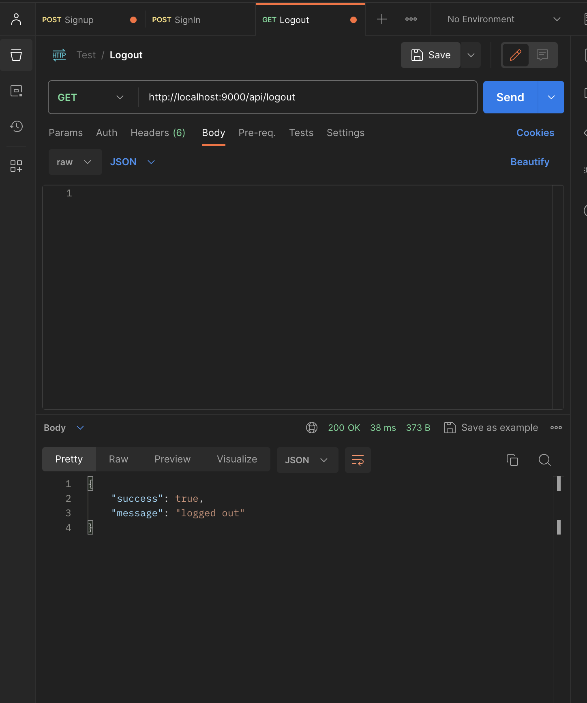

# API Documentation

This project provides several API endpoints for managing users and jobs. Below is a detailed overview of these endpoints.

## User Endpoints

### POST /api/signin

This endpoint is used for user authentication. It expects a JSON body with email and password fields.

Example request:

```bash
curl -X POST -H "Content-Type: application/json" -d '{"email": "user@example.com", "password": "password"}' http://localhost:9000/api/signin
```

### GET /api/logout

This endpoint is used to log out a user. It doesn't require any parameters.

Example request:

```bash
  curl -X GET http://localhost:9000/api/logout
```

## Job Endpoints

The job endpoints are not explicitly defined in the provided codebase. However, based on the project description, we can infer the following possible endpoints:

### POST /api/jobs

This endpoint is used to create a new job. It expects a JSON body with job details such as title and description.

Example Request:

```bash
curl -X POST -H "Content-Type: application/json" -d '{"title": "Software Engineer", "description": "Develop and maintain software"}' http://localhost:9000/api/jobs
```

### GET /api/jobs

This endpoint is used to retrieve a list of all jobs. It doesn't require any parameters.

Example Request:

```bash
curl -X GET http://localhost:9000/api/jobs
```

## Screenshots

Below are some screenshots from Postman while testing:





